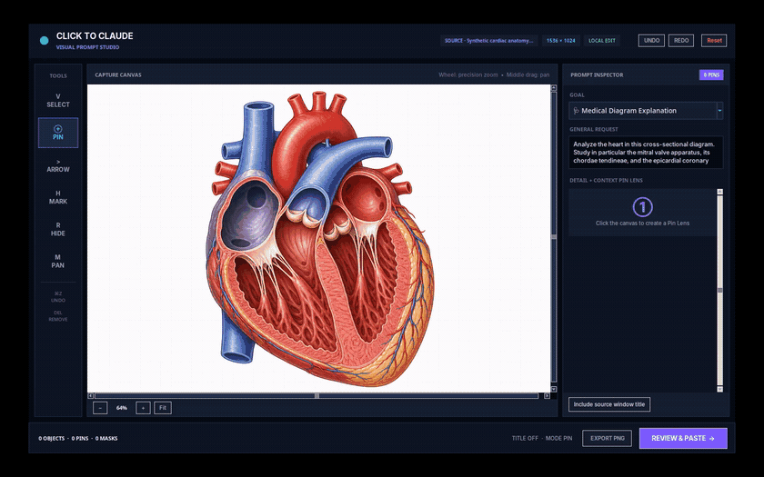

<p align="center">
  
</p>

# Click to Claude

[](https://github.com/AriPrez/click-to-claude/actions/workflows/quality.yml)
[](https://www.python.org/)
[](LICENSE)

Capture a Linux screen region, add numbered pins or redactions, and paste the
annotated image plus structured context into a dedicated Claude web-app window.
No Anthropic API key is required.

> [!IMPORTANT]
> Click to Claude is an independent community project. It is not affiliated
> with, endorsed by, or maintained by Anthropic.

## Demo

[](assets/precision-pin-medical-demo.mp4)

The demo analyzes the heart, focusing on the mitral valve apparatus, chordae
tendineae, and an epicardial coronary vessel. It uses a synthetic educational
illustration and no patient data.
[Open the full-quality MP4](assets/precision-pin-medical-demo.mp4) or the
[static interface preview](assets/product-overview.png).

## Why it is useful

- Select exactly the part of the screen you want to discuss.
- Target tiny details with a crosshair while keeping the exact pixel visible.
- Keep numbered badges offset from the structures they describe.
- Compare every point through a dual-scale Pin Lens: exact detail and surrounding
  visual context.
- Move, reorder, or remove pins individually.
- Draw arrows and highlights alongside privacy masks.
- Undo and redo annotation changes.
- Zoom up to 800% and pan without changing the exported screenshot resolution.
- Export the annotated result as a standalone PNG.
- Redact secrets before clipboard transfer.
- Add a general request and optional source-window context.
- Review the exact generated text before it is pasted.
- Keep automatic paste isolated from ordinary browser windows.

Click to Claude never presses Claude's final Send button. You can review the
image and prompt in Claude before submitting them.

## Example workflows

- Study anatomy, microscopy, scientific figures, maps, or technical diagrams.
- Ask one precise question per UI element while debugging software.
- Review dense documents, dashboards, charts, and presentation slides.
- Redact private details before asking for help with a screenshot.

## Compatibility

| Environment | Capture | Clipboard | Automatic paste |
| --- | --- | --- | --- |
| Ubuntu/Debian X11 | Supported | `xclip` | Supported with Chromium and `xdotool` |
| GNOME Wayland | Desktop-dependent | `wl-copy` | Only when the dedicated window is visible through XWayland |
| wlroots Wayland | `grim` + `slurp` | `wl-copy` | Only when the dedicated window is visible through XWayland |
| KDE | Manual shortcut setup | X11 or Wayland backend | Same X11/XWayland limitation |

Automatic paste is deliberately disabled if the dedicated Claude window cannot
be identified positively. In that case, the annotated image remains available
for manual paste.

## Installation

On Ubuntu, Debian, Pop!_OS, or another apt-based distribution:

```bash
git clone https://github.com/AriPrez/click-to-claude.git
cd click-to-claude
bash install.sh
```

The installer:

1. Installs the screenshot, clipboard, Tkinter, and Pillow dependencies.
2. Installs `click-to-claude` into `~/.local/bin`.
3. Adds the desktop launcher.
4. Registers `Super+C` on GNOME-based desktops.

On other desktops, assign `click-to-claude` to a global shortcut manually.

The first automatic launch uses a dedicated Chromium profile stored under
`~/.local/share/click-to-claude`. Sign in to Claude once in that window.

Run a read-only environment check at any time:

```bash
click-to-claude --diagnose
```

To remove the launchers while preserving the dedicated browser login:

```bash
bash uninstall.sh
```

## Usage

1. Press `Super+C`, or run `click-to-claude`.
2. Select a screen region.
3. Zoom onto a detail, then add precision pins and one question per location.
4. Switch to **Redact Area** and draw masks over private information.
5. Use **Select** to move pins or select any annotation for deletion.
6. Add arrows, highlights, and an optional general request.
7. Choose whether to include the source-window title.
8. Select **Review & Paste**, inspect the generated text, then approve the paste.
9. Review the result in Claude and submit it yourself.

### Visual Prompt Studio shortcuts

| Shortcut | Action |
| --- | --- |
| `V` | Select |
| `P` | Add pin |
| `A` | Arrow |
| `H` | Highlight |
| `R` | Redact |
| `Ctrl+Z` / `Ctrl+Y` | Undo / redo |
| `Delete` | Remove selected annotation |
| Mouse wheel | Precision zoom, up to 800% |
| Middle-button drag | Pan |
| `Ctrl+Enter` | Open final review |
| `Ctrl+S` | Export annotated PNG |
| `Esc` | Cancel |

## Privacy and safety

- Captures are created inside a private temporary directory and deleted when the
  program exits.
- Window-title context can be disabled before review.
- Paste is allowed only into a Chromium window created with Click to Claude's
  dedicated class and profile.
- The program does not claim that data was sent; it only reports that paste
  commands completed.

The dedicated browser profile still contains its own Claude login data. The
uninstaller preserves it intentionally and prints its location.

For medical or educational material, do not capture identifiable patient data.
Click to Claude is an annotation and transfer utility, not a medical device or
clinical decision-support system. Independently verify any AI-generated
explanation before using it for study or care.

## Development

Python 3.10 or newer is required.

```bash
python3 -m venv .venv
. .venv/bin/activate
python -m pip install -e ".[dev]"
ruff check .
ruff format --check .
pytest
```

The CI runs linting and tests across Python 3.10, 3.12, and 3.13.

The privacy-safe demo is reproducible on Linux when `Xvfb`, `xdotool`, and
`ffmpeg` are installed:

```bash
scripts/record_demo.sh
```

## Troubleshooting

### The review window opens but I cannot confirm

Press `Ctrl+Enter` while the review window is focused. You can also press `Tab`
until **Confirm and Paste** is selected, then press `Enter`. The confirmation
button remains in a fixed footer even when the prompt is long.

### Automatic paste stops

This is the expected fail-safe when Click to Claude cannot positively identify
its dedicated Chromium window. The annotated image remains in the clipboard:
open Claude manually, press `Ctrl+V`, then paste the reviewed prompt.

Run `click-to-claude --diagnose` and include its sanitized output in a bug
report. Remove usernames, window titles, paths, or other private information
first.

### `Super+C` does not launch the application

Another desktop action may already use that shortcut. Open the system keyboard
settings and assign a different global shortcut to `click-to-claude`.

### Capture or clipboard support is missing on Wayland

Install `grim`, `slurp`, and `wl-clipboard`. Some compositors intentionally
prevent automatic window activation; manual paste remains available.

## Current limitations

- Full Wayland automation is restricted by the compositor's security model.
- Automatic paste currently targets Chromium-family browsers.
- Text labels, freehand drawing, and automatic redaction suggestions are not yet
  implemented.
- Clipboard automation can confirm the operating-system commands, not that the
  Claude composer accepted every item.

## License

MIT. See [LICENSE](LICENSE).

Security reports should follow [SECURITY.md](SECURITY.md). Contributions are
welcome under [CONTRIBUTING.md](CONTRIBUTING.md).
